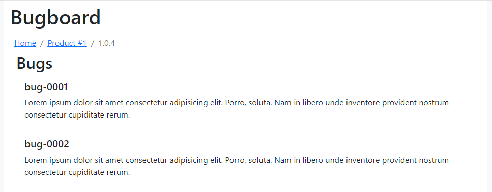

# 🐞 Bugboard

This web app shows a bugs: products -> product versions -> bugs.



# Feature

* `Bootstrap v5` is used for stylizing

# Usage

Installs the project

```
git clone https://github.com/yurimikushov/bugboard.git
cd bugboard
npm i
```

Checks a follow CSS writing conventions

```
npm run stylelint
```

Checks a follow JS writing conventions

```
npm run eslint
```

Runs the fake API for development on `localhost:3004`. You can see the fake data [here](fake-api-db.json)

```
npm run fake-api
```

Runs the app in `development` mode on `localhost:3000`

```
npm start
```

Builds the app for `production` to the `build` folder

```
npm build
```

# License

The project is available under the [MIT License](LICENSE).
